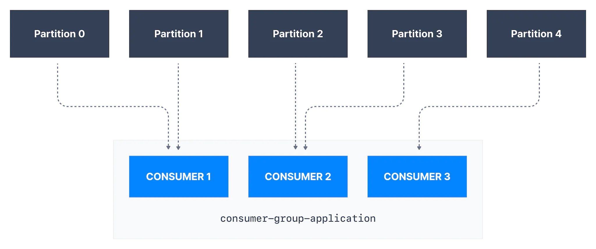

# 🚀 Apache Kafka

We will try to simulate it with the help of real-world examples.

## What is Apache Kafka?

Apache Kafka is just like any mall that decouples seller and consumer.

> Apache Kafka allows us to decouple data streams and systems. With Apache Kafka as a data integration layer, data sources will publish their data to Apache Kafka and the target systems will source their data from Apache Kafka.

## Kafka Analogy

1. Source System/Application = Seller(clothier, grocer) | Source system(web, mobile, and cloud)
2. Producer = Who sells the goods i.e. seller(outside of the mall)
3. Topic = Goods Name (Clothes, Food)
4. Brokers = Employee @ each section of Mall shop
5. Partition = Similar to category/section. Goods are broken down into sections/categories/partitions. For example -
   1. Men section,
   2. Women section,
   3. Veg section,
   4. Non-veg section
6. Offset = Index/Rack No
7. Key = Label like men, woman, veg, non-veg
8. Message = Label/Key + item + packaging + metadata about item + timestamp
9. Compression Type = Packing of goods(Box, gift, parcel)
10. Header = Metadata of Goods
11. Timestamp = A timestamp is added either by the user or the system in the message
12. Message Serializers = Representation of object(Label + Goods) in special format
13. Consumer = Who consumes the Goods i.e. customers

## Reference

1. Seller - S1 & S2
   1. S1 sells clothes i.e. clothiers.
   2. S2 sells food i.e. grocer.
2. Mall shops - MS1 & MS2
   1. MS1 is a clothes shop in the mall.
   2. MS2 is a food shop in the mall.
3. Goods - Messages
4. Item - Message

## Source System/Application

> Who generates/produces data/goods

In the real world, the Seller(clothier, grocer) is the application.

In technology, the Source system(web, mobile, and cloud) is an application.

## Topic

> Where data/goods go. Data/Goods will only move to the particular allotment.

Clothier goods will only move to the MS1(clothes shop) and grocer goods will move to MS2(Food Shop).

Similar to how databases have tables to organize and segment datasets, Kafka uses the concept of topics to organize related messages. A topic is identified by its name.

In the same way, a Web application is allocated to the web topic and a mobile application is allocated to the mobile topic.

Kafka topics are immutable: once data is written to a partition, it cannot be changed. t is like a non-returnable item.

## PARTITIONS

> Broken down into a number of partitions

Similar to category/section. Goods/Data are broken down into sections/categories/partitions.

In the clothier shop men can be a partition, and women can be another partition. In a food shop, veg and non-veg can be different partitions.

Here we are taking category/section for explaining purposes but in Kafka, partitions are numbered starting from 0 to N-1, where N is the number of partitions.

The number of partitions of a topic is specified at the time of topic creation.


## Kafka Offsets & Ordering

> Position of items where items are kept.

If men's jeans are placed in rack1 of the man category at 3rd position. It is not necessary that in rack1 of the woman's category women’s jeans will be in 3rd position. It may be at rack2 at the 5th position also.

Likewise in Kafka, If a topic has more than one partition, Kafka guarantees the order of messages within a partition, but there is no ordering of messages across partitions.

Suppose, the t-shirts of men section we count how many t-shirts are there? numbers are incremental and unique item-wise likewise in Kafka, offset numbering for every partition starts at 0 and is incremented for each message sent to a specific Kafka partition. 

The offset is an integer value that Kafka adds to each message as it is written into a partition. Each message in a given partition has a unique offset.

MS1 has multiple sections, MS1 guarantees the order of items within a section because items in each section will be different. MS1 shop's men's section, no of t-shirts are different from no of t-shirts from women's section. So, there is no ordering of items across partitions.

If a topic has more than one partition, Kafka guarantees the order of messages within a partition, but there is no ordering of messages across partitions.


## Producer

> Who sells the goods to mall/Applications that send data into topics are known as Kafka producers

Clothier who sends goods into MS1 is known as a Kafka producer. clothier typically integrated via that mall to sell goods to MS1.

Likewise in Kafka, Applications that send data into topics are known as Kafka producers. Applications typically integrate a Kafka client library to write to Apache Kafka.

Clothier sends goods to MS1 and goods are distributed to categorize according to a mechanism such as key hashing(It can be anything - man, woman, veg, non-veg).

A Kafka producer sends messages to a topic, and messages are distributed to partition according to a mechanism such as key hashing.

In the real world, the seller & buyer gives some kind of acknowledgment(acks) for goods delivery. Same way in Kafka also producer must specify a level of acknowledgment(acks) for a message to be successfully written into a Kafka topic.

## Message

> The message is nothing but label/key + item + packaging + metadata about item + timestamp. In Kafka, key + value + compression type + headers + timestamp.

## Kafka Message Anatomy

> The producer creates Kafka messages. A Kafka message consists of the following elements:


## Message Keys

> The key/label decides which item goes in which section.

Goods contain labels and items. Likewise in Kafka, each event message contains an optional key and optional value.

In case label/key (label/key=null) is not specified by the producer, goods are distributed evenly across categories in a round-robin fashion(`Kafka 2.3`) (partition p0 then p1 then p2, etc... then back to p0, and so on...). Suppose,

```
1. key=null, man jean comes the first time it will go to man category.
2. key=null, woman jeans come the second time it will go to woman category.
3. key=null, woman T-shirt comes 3rd time it will go to man category.
```

>When `key=null`, the producer has a default partitioner that varies:
>
> **Round Robin**: for Kafka 2.3 and below
>
> **Sticky Partitioner**: for Kafka 2.4 and above
>
> `Sticky Partitioner` improves the performance of the producer, especially with high throughput.

Likewise in Kafka, messages are distributed evenly across partitions in a topic. This means messages are sent in a round-robin fashion(`Kafka 2.3`) (partition p0 then p1 then p2, etc... then back to p0, and so on...).

In case label/key (label/key!=null) is specified by the producer.

All goods that share the same label/key will always be sent and stored in the same category.

```
1. key=man, man jean comes the first time it will go to man category.
2. key=woman, woman jeans come the second time it will go to woman category.
3. key=woman, woman T-shirt comes 3rd time it will go to woman category.
```

all messages that share the same key will always be sent and stored in the same Kafka partition.

Kafka message keys are commonly used when there is a need for message ordering for all messages sharing the same field.

## Message Value

> Item. The content of the message can be null. 

## Message Compression Type

> Packing of goods(Box, gift, parcel)/Compressed

When you send lots of goods then you packed in any kind of container. So you can send more goods with fewer resources. 
If you don't pack it then there is the possibility that goods will take more space and more resources and expect more management. In Kafka, compression type is nothing but the packing of messages.

The compression type can be specified as part of the message. Options are none, gzip, lz4, snappy, and zstd.

## Message Headers

> Metadata of goods/message

Specify metadata about the goods/message, especially for tracing.

## Message Topic + Partition + Offset

> The combination of topic + partition + offset uniquely identifies the message.

## Kafka Message Serializers

> Representation of the object(Label(Key) + Goods(Messages)) in special format

Clothier introduces the special language/code of goods and MS1's employees understand that special language/code.
Just like, in the computer world, we need to convert object/messages into understandable format i.e. binary.

Likewise in Kafka, Kafka brokers expect byte arrays as keys and values of messages.

```
We have a message with an Integer key and a String value. Since the key is an integer,
we have to use an IntegerSerializer to convert it into a byte array.
For the value, since it is a string, we must leverage a StringSerializer.
```

## Message Key Hashing

> Key Hashing is the process of determining the mapping of a key to a partition

Clothier defines such a mechanism that mechanism will determine which goods to which mall shop using the key(key=cloth, key=food)

A Kafka partitioner is a code logic that takes a record and determines to which partition to send it.

In that effect, it is common for partitioners to leverage the Kafka message keys to route a message into a specific topic-partition. As a reminder, all messages with the same key will go to the same partition.

In the default Kafka partitioner, the keys are hashed using the murmur2 algorithm

## Consumers

> Who consumes the Goods/Data

When you go to the mall and purchase those clothes according to your need. It is called a consumer. In the same way, Applications that read data from Kafka topics are known as consumers.

Consumers typically integrated via the mall to consume goods from MS1. Applications integrate a Kafka client library to read from Apache Kafka.

Customers can choose a dress from one or more categories/sections at a time in the mall. In the same way, Consumers can read from one or more partitions at a time in Apache Kafka.

Suppose, data arrived in this way


```
1. topic=man, key=man-jean, man jean comes the first time it will go to man-jean category.
2. topic=woman, key=woman-jean, woman jeans come the second time it will go to woman-jean category.
3. topic=woman, key=woman-T-shirt, woman T-shirt comes 3rd time it will go to woman-T-shirt category.
4. topic=man, key=man-T-shirt, man T-shirt comes 4th time it will go to man-T-shirt category.
5. topic=man, key=man-T-shirt, man T-shirt comes 4th time it will go to man-T-shirt category.
```

When we go to the man's section and woman's section, we can pick one or more item(s) from the man and woman's section at a time. We will look at clothes one by one, first, we check the "S" size, then the "M" size, then the "XL" size because we need "XL" size. Basically, we are checking the size in the order in which they are kept.

In the same way, Consumers can read from one or more partitions at a time in Apache Kafka, and data is read in order within each partition. A consumer always reads data from a lower offset to a higher offset and cannot read data backward (due to how Apache Kafka and clients are implemented).

If the consumer consumes data from more than one partition, the message order is not guaranteed across multiple partitions because they are consumed simultaneously, but the message read order is still guaranteed within each individual partition.

When we go to any section and see whatever clothes are there you can take, but sometimes you need specific clothes but you are not able to find and ask mall shop employee and they will guide us.

In the same way, By default, Kafka consumers will only consume data that was produced after it is first connected to Kafka. This means that to read historical data in Kafka, one must specify it as an input to the command.

Kafka consumers are also known to implement a "pull model". In the mall, you can go and select any item according to your need. The employee of that shop will not help unless you asked for it.

Likewise in Kafka, consumers must request data from Kafka brokers in order to get it (instead of having Kafka brokers continuously push data to consumers). This implementation was made so that consumers can control the speed at which the topics are being consumed.

`Note: Clothier & Consumer are not part of the mall. They are connected through the mall. Likewise, Kafka producers and consumers are also connected through the Kafka client library to read from/ write to Apache Kafka`.

## Kafka Message Deserializers

> Data being consumed must be deserialized in the same format it was serialized in.

> Poison Pills
> 
> Messages sent to a Kafka topic that does not respect the agreed-upon serialization format are called poison pills. They are not fun to deal with.

## Kafka Consumer Groups

> Consume the Goods/Data in a group

When we go in the group then we will tell one person to select all jeans and another will select t-shirts. So you are leveraging parallelism and distributing work.

Likewise in Kafka, for horizontal scalability purposes, it is recommended to consume Kafka topics as a group. A topic usually consists of many partitions. These partitions are a unit of parallelism for Kafka consumers. The benefit of leveraging a Kafka consumer group is that the consumers within the group will coordinate to split the work of reading from different partitions.



## Kafka Consumer Group ID

> Identity

In the mall, we go in the group, and sometimes an employee of the shop asks what do you want? but when we say that we are in the same group after that everything is fine. In Kafka also, in order for indicating to Kafka consumers that they are part of the same specific group, we must specify the consumer-side setting group.id.

Kafka Consumers automatically use a `GroupCoordinator` and a `ConsumerCoordinator` to assign consumers to a partition and ensure the load balancing is achieved across all consumers in the same group.

It is important to note that each topic partition is only assigned to one consumer within a consumer group, but a consumer from a consumer group can be assigned multiple partitions.

Each of your applications (that may be composed of many consumers) reading from Kafka topics must specify a different group.id. That means that multiple applications (consumer groups) can consume from the same topic at the same time:


If there are more consumers than the number of partitions of a topic, then some consumers will remain inactive as shown below. Usually, we have as many consumers in a consumer group as the number of partitions. If we want more consumers for higher throughput, we should create more partitions while creating the topic. Otherwise, some of the consumers may remain inactive.


Credits - [Conduktor](https://www.conduktor.io/kafka) | [Stéphane Maarek](https://www.linkedin.com/in/stephanemaarek)

> Happy Coding! :v:
