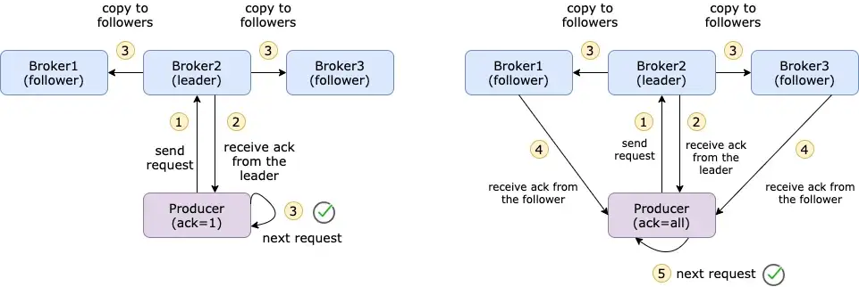
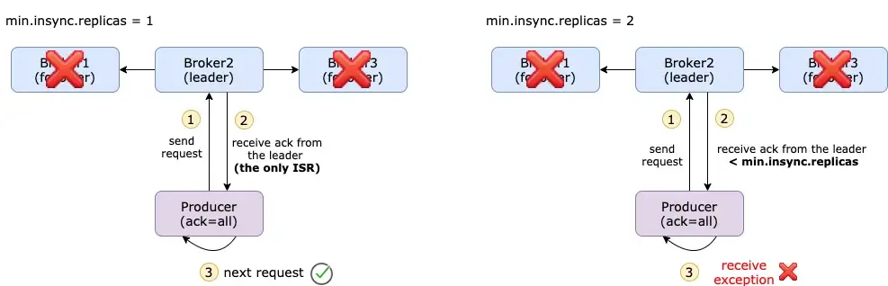

# 👊 Producer Config - acks

Deep dive into Kafka producers config `acks`

> - An ack is an acknowledgment that the producer gets from a Kafka broker to ensure that the message has been successfully committed to that broker.
>
> - acks which is the number of brokers who need to acknowledge receiving the message before it is considered a successful write. We use another Kafka configuration min.insync.replicas along with this producer configuration.

acks = 0

> When `acks=0` producers consider messages as "written successfully" the moment the message was sent without waiting for the broker to accept it at all.

acks = 1

> When `acks=1`, producers consider messages as "written successfully" when the message was acknowledged by only the leader.

acks = all

> When `acks=all`, producers consider messages as "written successfully" when the message is accepted by all in-sync replicas (ISR).
>
> The producer gets acks from all the in-sync replicas of this topic. It gives the strongest message durability, but it also takes long time which results in higher latency. So, you need to decide what is more important for you.
```commandline
The default value of acks has changed with Kafka v3.0
If using Kafka < v3.0, acks=1
If using Kafka >= v3.0, acks=all
```



> What is In-sync replicas?
> - Basically defines how many replicas that the producer must receive before considering a successful commit. 
> - When you create a topic, you must define how many replicas you want. 
> - A replica is nothing more than a copy of the message in one of the brokers, so the maximum number of replicas is the number of brokers.
> - An in-sync replica is a replica that fully catches up with the leader in the last 10/30 seconds. 
> - The time period can be configured via **replica.lag.time.max.ms**. If a broker goes down or has network issues, then it couldn’t follow up with the leader and after 10/30 seconds, this broker will be removed from ISR.
> - This config(`min.insync.replicas`) adds on top of acks=all and makes your messages safer. But on the other hand, you have to balance latency and speed.

```commandline
The default value of replica.lag.time.max.ms has changed with Kafka v2.5
If using Kafka < v2.5, replica.lag.time.max.ms=10000 (10 seconds)
If using Kafka >= v2.5, replica.lag.time.max.ms=30000 (30 seconds)
```
The lead replica for a partition checks to see if there are enough in-sync replicas for safely writing the message (controlled by the broker setting min.insync.replicas). The request will be stored in a buffer until the leader observes that the follower replicas replicated the message, at which point a successful acknowledgement is sent back to the client.

If a topic has three replicas and you set `min.insync.replicas` to 2, then you can only write to a partition in the topic if at least two out of the three replicas are in-sync. When all three replicas are in-sync, everything proceeds normally. This is also true if one of the replicas becomes unavailable. However, if two out of three replicas are not available, the brokers will no longer accept produce requests. Instead, producers that attempt to send data will receive `NotEnoughReplicasException`.



The default minimum in-sync replica (`min.insync.replicas`) is 1. It means that if all the followers go down, then ISR only consists of the leader. Even if acks is set to all, it actually only commits the message to 1 broker (the leader) which makes the message vulnerable.

### Kafka Topic Durability & Availability
let's consider a replication factor of 3:

- Reads: As long as one partition is up and considered an ISR, the topic will be available for reads.
- Writers:
  - `acks=0 | acks=1` : as long as one partition is up and considered an ISR, the topic will be available for writes.
  - `acks=all`:
    - `min.insync.replicas=1` (default): The topic must have at least 1 partition up as an ISR (that includes the reader) and so we can tolerate two brokers being down.
    - `min.insync.replicas=2`: The topic must have at least 2 ISR up, and therefore we can tolerate at most one broker being down, and we have the guarantee that for every write, the data will be at least written twice.
    - `min.insync.replicas=3`: This wouldn't make much sense for a corresponding replication factor of 3 and we couldn't tolerate any broker going down.
    
In summary, when `acks=all` with a `replication.factor=N` and `min.insync.replicas=M` we can tolerate N-M brokers going down for topic availability purposes.

[What About Retries?](https://github.com/varunajmera0/apache-kafka/blob/main/kafka-producers/advance/md_files/retries.md "Retries Config")


> Happy Coding! :v:
