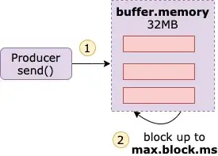
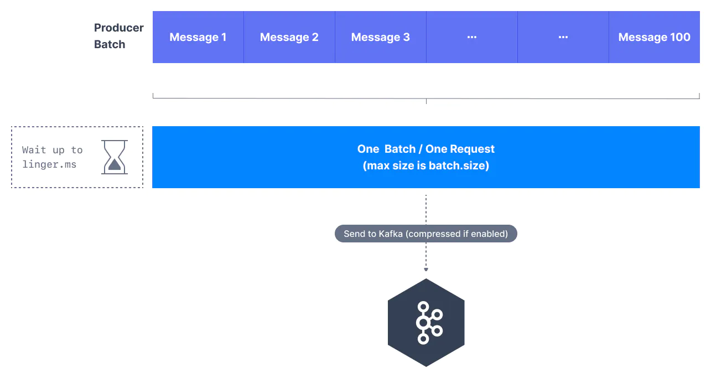

# 👊 Producer Config - batch.size

Deep dive into Kafka producers config `batch.size`

By default, Kafka producers try to send records as soon as possible. A producer will have up to 5 requests in flight (controlled by the max.in.flight.requests.per.connection setting), meaning up to 5 message batches will be sent at the same time. After this, if more messages have to be sent while others are in flight, Kafka producers are smart and producers will start batching messages while the previous message requests are finishing.

This smart batching allows Kafka to increase throughput while maintaining very low latency. Batches have a higher compression ratio so a better disk and networking efficiency. Batching is mainly controlled by two producer settings - `linger.ms` and `batch.size`.

## max.block.ms

The configuration controls how long the KafkaProducer's send(), partitionsFor(), initTransactions(), sendOffsetsToTransaction(), commitTransaction() and abortTransaction() methods will block. 
1. For send() this timeout bounds the total time waiting for both metadata fetch and buffer allocation. 
2. For partitionsFor() this timeout bounds the time spent waiting for metadata if it is unavailable. 
3. The transaction-related methods always block, but may timeout if the transaction coordinator could not be discovered or did not respond within the timeout.

This parameter controls how long the producer will block when calling send() and when explicitly requesting metadata via partitionsFor(). Those methods block when the producer’s send buffer is full or when metadata is not available. When max.block.ms is reached, a timeout exception is thrown. The default value is 60000.

## buffer.memory

When the producer calls `send()`, the messages will not be immediately sent but added to an internal buffer. 
The default `buffer.memory` is 32MB. If the producer sends messages faster than they can be transmitted to the broker or there is a network issue, 
it will exceeds `buffer.memory` then the `send()` call will be blocked up to `max.block.ms` (default 1 minute).

## linger.ms

The delay time before the batches are ready to be sent. The default value is 0 which means batches will be immediately sent even if there is only 1 message in the batch. 
Sometimes, people increase linger.ms to reduce the number of requests and improve throughput. But this will lead to more messages kept in memory. So, make sure that you take care of both sides.

By introducing some lag (for example linger.ms=20), we increase the chances of messages being sent together in a batch. So at the expense of introducing a small delay, we can increase the throughput, compression, and efficiency of our producer. If a batch reaches its maximum size (controlled by batch.size) before the end of the linger.ms period, it will be sent to Kafka right away!

## batch.size

The producer will attempt to batch records together into fewer requests whenever multiple records are being sent to the same partition. 
This helps performance on both the client and the server. This configuration controls the default batch size in bytes.
The maximum amount of data that can be sent in a single request. If batch.size is (32*1024) that means 32 KB can be sent out in a single request.

`batch.size` is the maximum number of bytes that will be included in a batch.

The default is `16KB`. Increasing a batch size to `32KB` or `64KB` can help increase the compression, throughput, and efficiency of requests. Any message that is bigger than the batch size will not be batched. A batch is allocated per partition, so make sure that you don’t set it to a number that’s too high, otherwise you may run into high memory usages!

If `Small batch size`:

    > N/W consumption more/Not efficiently use network.
    > Reduce throughput(Throughput is a measure of how many units of information a system can process in a given amount of time.). 
      It will process less information when batch size is small.

if `Large batch size`:

    > Use memory a bit more wastefully as we will always allocate a buffer of the specified batch size.

> Key Takeaways
> - Increase `linger.ms` and the producer will wait a few milliseconds for the batches to fill up before sending them.
> 
> - If you are sending full batches and have memory to spare, you can increase `batch.size` and send larger batches.

> Happy Coding! :v: