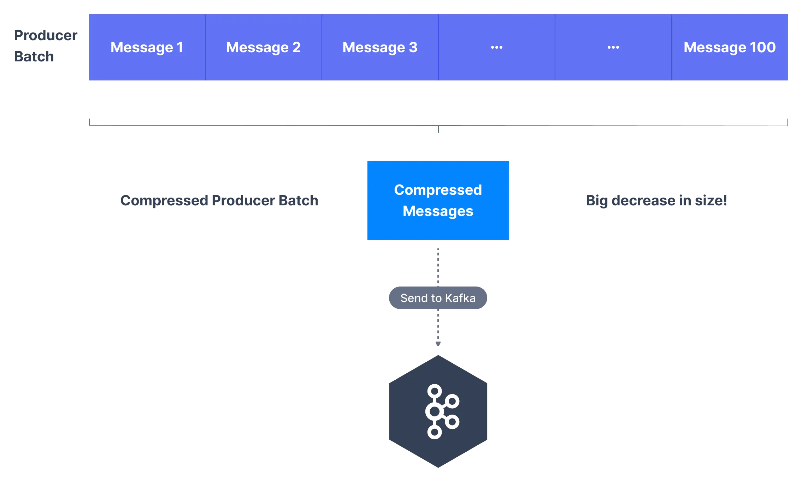

# 👊 Producer Config - compression.type

Deep dive into Kafka producers config `compression.type`

Producers usually send data that is text-based, for example with JSON data. In this case, it is important to apply compression to the producer. By default, producer messages are sent uncompressed.

> Kafka supports two types of compression: producer-side and broker-side.

1. Producer-Side - doesn’t require any configuration change in the brokers or in the consumers. Producers may choose to compress messages with the compression.type setting.
   - Options are none, gzip, lz4, snappy, and zstd. 
   - Compression is performed by the producer client, if enabled.
   - This is particularly efficient if the producer batches messages together (high throughput).
   

2. Broker-Side (topic-level) - with the setting compression.type.
   - If the compression codec of the destination topic is set to compression.type=producer, the broker takes the compressed batch from the client and writes it directly to the topic’s log file without recompressing the data. 
   - By default, the topic compression is defined as `compression.type=producer`.
   - If the topic has its own compression setting (for example `lz4`) and the value matches the producer setting, the message batch is written as is to the log file, otherwise, the broker will decompress and recompress the messages into its configured format.

### Producer-Level Message Compression in Kafka

Producers group messages in a batch before sending. This is done to save network trips. If the producer is sending compressed messages, all the messages in a single producer batch are compressed together and sent as the "value" of a "wrapper message". Compression is more effective the bigger the batch of messages being sent to Kafka!

> By enabling compression, you reduce network utilization and storage, which is often a bottleneck when sending messages to Kafka. The compressed batch has the following advantage:
>
> - Much smaller producer request size (compression ratio up to 4x!)
> - Faster to transfer data over the network => less latency
> - Better throughput 
> - Better disk utilization in Kafka (stored messages on disk are smaller)
>
> Compression, however, has a small overhead on CPU resources as it involves compression and decompression.
>
> - Producers must commit some CPU cycles to compression
> - Consumers must commit some CPU cycles to decompression

Always use compression in production and especially if you have high throughput.

> Happy Coding! :v: