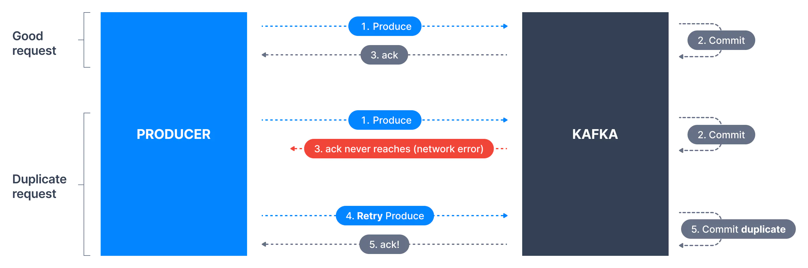
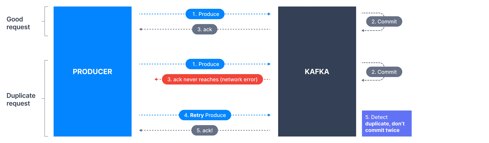

# 👊 Producer Config - enable.idempotence

Deep dive into Kafka producers config `enable.idempotence`

Retrying to send a failed message often includes a small risk that both messages were successfully written to the broker, leading to duplicates. This can happen as illustrated below.

- Kafka producer sends a message to Kafka

- The message was successfully written and replicated

- Network issues prevented the broker acknowledgment from reaching the producer

- The producer will treat the lack of acknowledgment as a temporary network issue and will retry sending the message (since it can’t know that it was received).

- In that case, the broker will end up having the same message twice.

Let’s say we have a producer that sends 1M messages to the topic and the broker fails after the messages have been committed but before the producer receives all the acks. 
In this case, we will probably end up with more than 1M messages on the topic. This is also called `at-lease-once semantics`.

The most ideal situation is `exactly-once semantics` where even if the producer resends the message, the consumer should receive the same message only once.
Idempotent is `exactly-once semantics`.

> What is an Idempotent Producer?
> 
>  Idempotent means that applying an operation once or applying it multiple times have the same effect. It’s very easy to turn this feature on with config `enable.idempotent=true` and `acks=all` in Kafka 3.0.

> How does it work?
> 
> When enable.idempotence is set to true, each producer gets assigned a Producer Id (PID) and the PIDis included every time a producer sends messages to a broker. 
> 
> Additionally, each message gets a monotonically increasing sequence number (different from the offset - used only for protocol purposes). 
> 
> A separate sequence is maintained for each topic partition that a producer sends messages to. 
> 
> On the broker side, on a per partition basis, it keeps track of the largest PID-Sequence Number combination that is successfully written. When a lower sequence number is received, it is discarded.

## max.in.flight.requests.per.connection
Controls the number of unacknowledged requests the client will send on a single connection before blocking.

> Send messages in order
>
> - Another important config to ensure the order is max.in.flight.requests.per.connection, and the default value is 5. 
>
> - This represents the number of unacknowledged requests that can be buffered on the producer side. If the retries is greater than 1 and the first request fails, but the second request succeeds, then the first request will be resent and messages will be in the wrong order.

Read More - [KIP-185](https://cwiki.apache.org/confluence/display/KAFKA/KIP-185%3A+Make+exactly+once+in+order+delivery+per+partition+the+default+producer+setting)

> Key Takeaways
> - if we enable idempotence `enable.idempotence=true`, then it is required for `max.in.flight.requests.per.connection` to be less than or equal to 5 with message ordering preserved for any allowable value!!

> Happy Coding! :v: