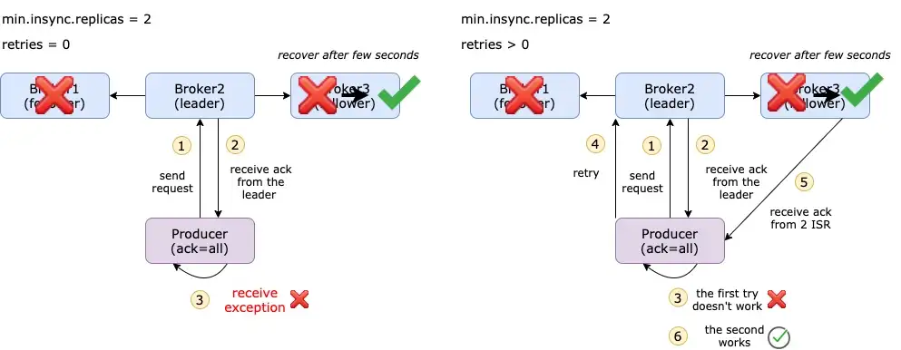
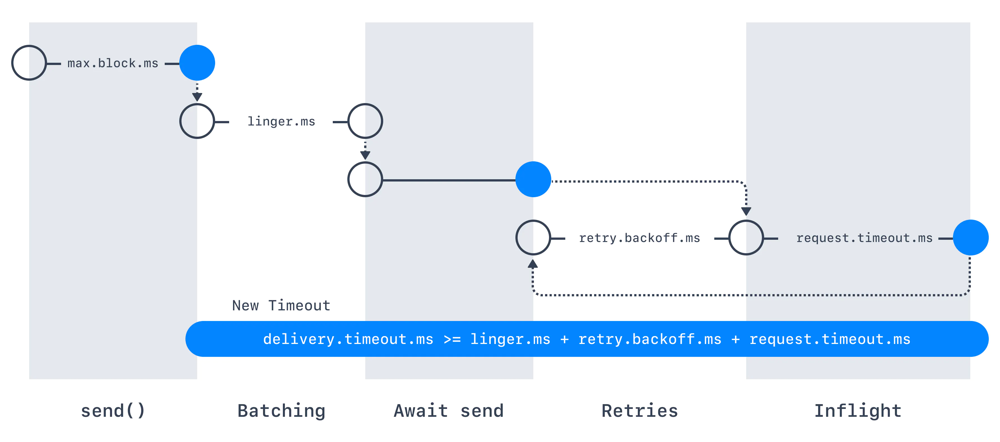

# 👊 Producer Config - retries

Deep dive into Kafka producers config `retries`

> - When the producer sends messages to a broker, the broker can return either a success or an error code.
> 
> - When we receive `NotEnoughReplicasException` error or any other error, in this case `retries` config can help you.
> 
> - It is desirable to enable retries in order to ensure that no messages are dropped when sent to Apache Kafka.
> 
> - The retries setting determines how many times the producer will attempt to send a message before marking it as failed. 

Let’s say you set `acks=all` and `min.insync.replicas=2`.

For some reason, the follower goes done, then the producer identifies a failed commit because it could not get `acks` from `min.insync.replicas` brokers. An error message from the producer :point_down:

```
org.apache.kafka.common.errors.NotEnoughReplicasException
```

It means that even if the broker is running, Kafka will not append the messages to that running broker if the current ISR is not sufficient.

```commandline
The default value of retries has changed with Kafka v2.1
If using Kafka < v2.0, retries=0
If using Kafka >= v2.1, retries=2147483647 i.e. MAX_INT
```

`retries=0`

The producer will not act upon this error, so it will lose messages. This is called `at-most-once semantics`.

`retries=n`

This is basically the maximum number of retries the producer would do if the commit fails. 



Users should generally prefer to leave this config unset and instead use `delivery.timeout.ms` properity to control retry behavior.

## delivery.timeout.ms

If `retries > 0`, for example, retries = 2147483647 (Kafka >= v2.1), the producer won’t try the request forever, it’s bounded by a timeout. For this, you can set an intuitive Producer Timeout [(KIP-91 – Kafka 2.1)](https://cwiki.apache.org/confluence/display/KAFKA/KIP-91+Provide+Intuitive+User+Timeouts+in+The+Producer) such as delivery.timeout.ms=120000 (= 2 minutes). Records will be failed if they can’t be delivered in delivery.timeout.ms



## retry.backoff.ms

By default, the producer will wait 100ms between retries, but you can control this using the retry.backoff.ms parameter.

[What About Duplicate Messages & Order Of Message?]()

> Happy Coding! :v:
